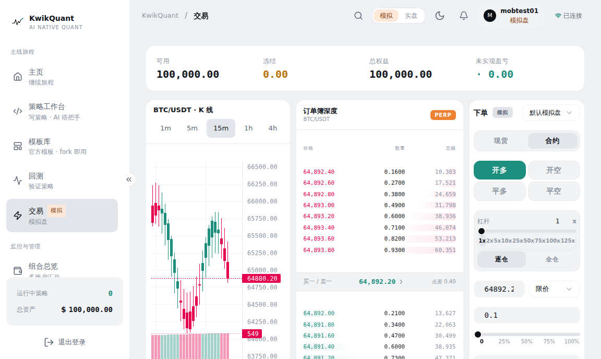
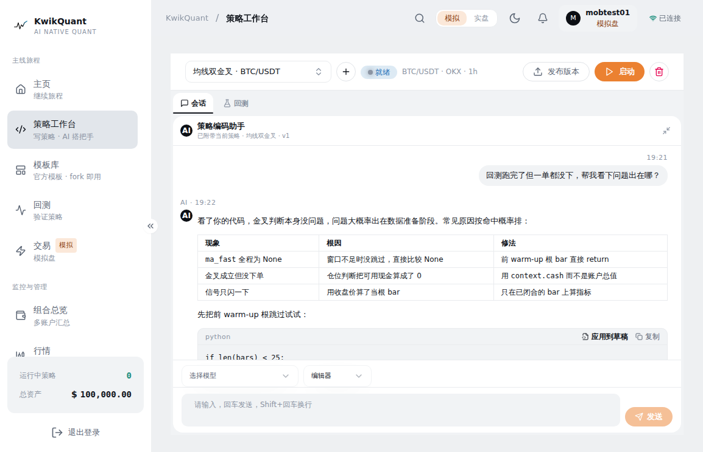
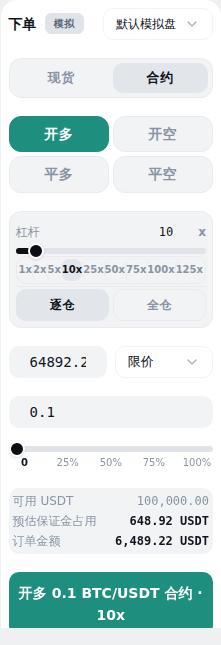

# KwikQuant

> 自托管加密货币量化交易系统 — Java 撮合内核 + Python 策略 worker + 实盘 CCXT 接入,模拟盘与实盘同执行接口,合约全仓/逐仓 + 资金费率落账 + 强平同步。

[](LICENSE)
[](https://www.oracle.com/java/)
[](https://spring.io/projects/spring-boot)
[](https://github.com/huiboxes/kwikquant/actions/workflows/ci.yml)
[](https://www.postgresql.org/)
[](https://github.com/huiboxes/kwikquant)

## 为什么用 KwikQuant

- **自托管,密钥自持**:交易所 API key 本地 AES-256-GCM 加密落库,不经第三方托管。你的 key 只在你的机器上。
- **模拟盘与实盘同源**:策略先在模拟盘跑通,再切实盘——两者走同一执行接口,切换不改代码。
- **合约能力完整**:全仓/逐仓、资金费率 8 小时结算落账、强平同步持仓,合约链路与现货对等。
- **AI 原生**:内置 MCP server,AI agent 可直接下单、查持仓、查风控、读行情,21 个工具 + PAT 鉴权。

## 特性

- **Spring Modulith 多模块**强边界(`shared` / `account` / `market` / `trading` / `risk` / `strategy` / `report` / `notification` / `mcp`),ArchUnit 在测试期强制 `domain` 不依赖 Spring。
- **CCXT Java 多交易所接入**:OKX / Binance 等,统一符号格式(`BTC/USDT`),无 instruments 表,动态发现。
- **模拟盘 + 实盘同 `Executor` 接口**:`PaperExecutor`(Java 撮合内核)/ `LiveExecutor`(CCXT 实盘)。
- **合约**:全仓 + 逐仓 + 强平同步 + 资金费率 8h 结算 + CROSS/ISOLATED 分流。
- **历史回测**:Java 撮合三态一致(模拟盘 = 实盘 = 回测)。
- **Python 策略 worker**:event loop + 回测 runner,策略代码热加载。
- **WebSocket 实时推送**:行情 / 订单 / 持仓 / 资金费 / 强平事件。
- **MCP server**:21 工具,PAT(Personal Access Token)+ HMAC 鉴权,AI agent 直连交易。
- **`kwikquant` CLI**:命令行下单 / 查仓 / 查风控,DTO record 对齐。

## 截图

**合约交易页** — 实时行情 + 订单簿 + 下单/持仓/成交三表



**策略工作台** — Python 策略编码 + AI 会话结对 + 回测双 tab



**合约下单面板** — 开多/开空/平多/平空四向 + 杠杆 + 逐仓/全仓



## 快速开始

```bash
git clone https://github.com/huiboxes/kwikquant.git kwikquant
cd kwikquant
docker compose -f docker/docker-compose.yml up -d   # PostgreSQL 16
```

```bash
cp .env.example .env
# 填 POSTGRES_* / JWT_SECRET / ENCRYPTION_KEY / KWIKQUANT_MCP_PEPPER
# 一键生成三个 secret:
#   cat >> .env << EOF
#   JWT_SECRET=$(openssl rand -base64 32)
#   ENCRYPTION_KEY=$(openssl rand -base64 32)
#   KWIKQUANT_MCP_PEPPER=$(openssl rand -base64 32)
#   EOF
```

```bash
./mvnw clean verify   # 编译 + 测试 + 覆盖率 95% + 格式,首次 5-10 分钟
```

```bash
./mvnw spring-boot:run -Dspring-boot.run.profiles=dev
cd frontend && pnpm install && pnpm gen:api && pnpm dev   # → http://localhost:5173
```

详细上手(含 Colima / proxy / `.env` 坑记)见 [`docs/quickstart.md`](docs/quickstart.md)。

## 文档

| 文档 | 内容 |
|---|---|
| [`docs/quickstart.md`](docs/quickstart.md) | 详细上手 + 坑记 |
| [`docs/cli-reference.md`](docs/cli-reference.md) | CLI 命令参考 |
| [`docs/mcp-setup.md`](docs/mcp-setup.md) | MCP server 接入 |
| [`docs/llm-integration.md`](docs/llm-integration.md) | LLM 集成 |
| [`docs/ws-contract.md`](docs/ws-contract.md) | WebSocket 契约 |
| [`docs/behavior-contract.md`](docs/behavior-contract.md) | 行为契约 |
| [`docs/changelog.md`](docs/changelog.md) | 变更记录 |
| [`docs/deploy.md`](docs/deploy.md) | 部署手册(tag 发版 + GHCR + 回滚) |
| [`frontend/DESIGN.md`](frontend/DESIGN.md) | 前端视觉契约 |

## 技术栈

| 层 | 技术 |
|---|---|
| 后端 | Java 21 · Spring Boot 4.1 · Spring Modulith · MyBatis |
| 数据库 | PostgreSQL 16 · Flyway(V1–V46) |
| 交易所 | CCXT Java(OKX / Binance) |
| 前端 | React 19 · Vite 8 · TypeScript 6 · Tailwind v4 |
| 策略 worker | Python 3.12 |
| 质量 | JaCoCo 95% 硬门控 · Spotless(Palantir Java Format) · ArchUnit · Testcontainers |

## 项目结构

```
kwikquant/
├── src/main/java/com/kwikquant/   # 后端模块
│   ├── shared/        # 类型 + 基础设施
│   ├── account/       # 鉴权 + 交易所账户
│   ├── market/        # 行情(CCXT)
│   ├── trading/       # 订单 + 撮合 + 持仓
│   ├── risk/          # 风控闸
│   ├── strategy/      # 策略 + 回测 + worker 编排
│   ├── report/        # 报表(回测 / 持仓 / 成交)
│   ├── notification/  # 事件通知
│   └── mcp/           # MCP server(AI 工具)
├── frontend/          # React 前端
├── kwikquant_worker/  # Python 策略 worker
├── docs/              # 契约 + 文档站
└── docker/            # compose
```

## 开发

贡献指南见 [`CONTRIBUTING.md`](CONTRIBUTING.md)(含环境搭建、坑记、commit 规范)。

日常命令:

```bash
./mvnw clean verify                                          # 全量验证(测试+覆盖率+格式)
./mvnw test -Pno-spotless                                   # 只跑测试(跳格式)
./mvnw spotless:apply                                       # 一键格式化
cd frontend && pnpm typecheck && pnpm lint && pnpm test && pnpm build   # 前端验证
```

## License

[Apache-2.0](LICENSE) © 2026 chuanpu
