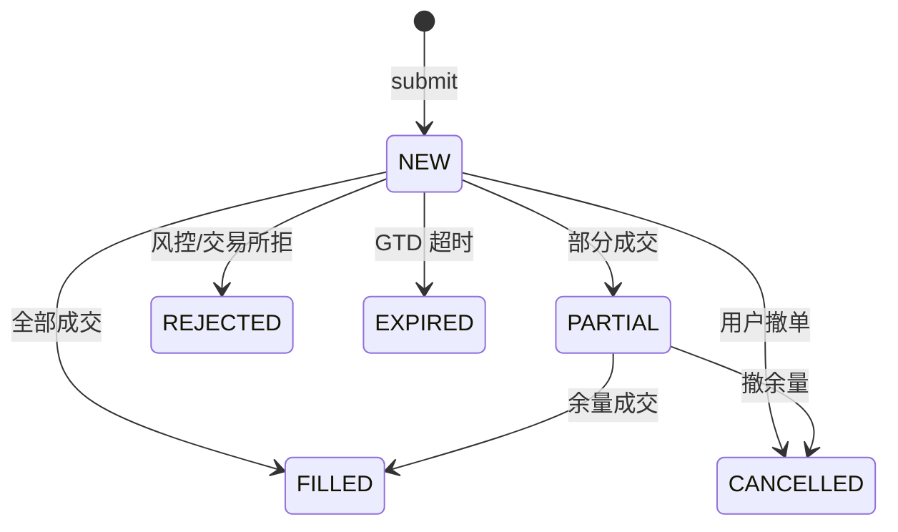

# KwikQuant 行为契约（behavior-contract）

> 版本：0.0.1（Wave 8 契约冻结）。本文档补充 OpenAPI 表达不了的**行为协议**——鉴权流程、状态机、轮询、二次确认、错误码处理映射。
> 与 `docs/ws-contract.md`、OpenAPI spec（`/v3/api-docs`）并称前端契约三件套。前端基于三件套可独立完成 95%+ 需求。
> 错误码 catalog 见 `ErrorCode.java`；模块专属错误码推导规则见 `api-contract-100/tech-design.md` §1.2。

---

## §1 鉴权流程

### 1.1 JWT access/refresh 双 token

- **登录**：`POST /api/v1/auth/login` → 返回 `accessToken`（body）+ 设置 `refresh_token` cookie（HttpOnly + Secure + SameSite=Strict，path=`/`，maxAge=7d）。
- **access token**：有效期 **15min**（`kwikquant.jwt.access-token-ttl`，默认 `15m`），前端放 `Authorization: Bearer <token>`。
- **refresh token**：有效期 **7d**（`kwikquant.jwt.refresh-token-ttl`，默认 `7d`），HttpOnly cookie，前端 JS 不可读；刷新时**旋转**（旧 refresh 失效，下发新 refresh）。
- **401 续期**：见 §1.1.1 单飞续期 + 请求重放。
- **refresh 失败**（401/400）→ 清 token + 跳登录页。

#### 1.1.1 401 单飞续期 + 请求重放（前端核心难点）

并发多个请求同时 401 时，refresh 必须**单飞**（只发一次 refresh，其余请求 await 同一 promise）避免 refresh token 被多次消耗；refresh 成功后**重放原请求**（用新 access token 重发被 401 的请求），对用户无感。

```js
let refreshing = null;

async function on401Replay(failedRequest) {
  if (!refreshing) {
    refreshing = fetch('/api/v1/auth/refresh', {
      method: 'POST',
      credentials: 'include',          // 带 refresh_token cookie
    }).then(res => res.ok ? res.json() : Promise.reject(res));
  }
  try {
    const { data: { accessToken } } = await refreshing;
    refreshing = null;
    failedRequest.headers.Authorization = `Bearer ${accessToken}`;
    return api.request(failedRequest.config);  // 重放原请求
  } catch (e) {
    refreshing = null;
    clearTokenAndRedirectToLogin();
    throw e;
  }
}
```

- refresh 失败（401/400）→ 清 token + 跳登录页，不再重试。
- 重放只对**幂等或安全**的请求重试；POST 下单等非幂等请求 401 后**不自动重放**（避免重复下单），改为提示"登录已过期，请重新登录后重试"。

### 1.2 鉴权白名单

SecurityConfig `permitAll` 的端点（前端拦截器**不附 Bearer**）：

| 端点 | 说明 |
|---|---|
| `POST /api/v1/auth/register` | 注册（公开） |
| `POST /api/v1/auth/login` | 登录（公开） |
| `POST /api/v1/auth/refresh` | 刷新（公开，靠 cookie） |
| `GET /actuator/health/**` | 健康检查（公开） |
| `GET /v3/api-docs/**` | OpenAPI spec（公开） |
| `GET /swagger-ui/**`、`/swagger-ui.html` | Swagger UI（公开） |

其余 `/api/v1/**` 全部需 JWT。`/mcp/**` 走 PAT filter（前端不消费）。`/api/v1/backtests/*/orders` + `POST /api/v1/orders`（Worker 通道）走 X-Worker-Token filter。

### 1.3 filter/entry-point 直写码（不经 @RestControllerAdvice）

以下 3 个错误码由 filter/entry-point **直接写 response body**，不经过 `@RestControllerAdvice`，前端/Worker 客户端需单独识别：

| 触发 | HTTP | code | 来源 |
|---|---|---|---|
| Worker 请求 X-Worker-Token 缺失/失效/endpoint 不匹配 | 401 | **7301** WORKER_TOKEN_INVALID | `WorkerTokenFilter` 直写 |
| MCP 请求 PAT 缺失/失效 | 401 | **10001** MCP_TOKEN_INVALID | `McpTokenAuthenticationFilter` 直写 |
| JWT 未带/失效（非 /mcp、非 Worker 路径） | 401 | **1001** UNAUTHENTICATED | `JsonErrorWriter.commence`（Spring Security AuthenticationEntryPoint） |

> 这三个码不在 `api-contract-100/tech-design.md` §1.2 的 ExceptionHandler 表内（因不走 advice），前端拦截器按 body.code 识别即可——envelope 结构与 advice 路径一致（`{code, message, data:null, traceId}`）。

### 1.4 PAT 通道（MCP/Worker 用，前端不消费）

- PAT（Personal Access Token）供 MCP Agent 客户端用，前端不直接消费；仅说明存在。
- Worker service token（X-Worker-Token）供 Runner/Backtest Worker 用，前端不消费。
- 时序见 §5 Worker 编排流程。

---

## §2 订单状态机



| 转移 | 触发 | 前端列表更新 |
|---|---|---|
| → NEW | `POST /orders` 成功 | REST 201 + WS `OrderEvent`(status=NEW) |
| → PARTIAL | 撮合部分成交 | WS `FillEvent` + `OrderEvent`(status=PARTIAL) |
| → FILLED | 全部成交 | WS `FillEvent` + `OrderEvent`(status=FILLED) |
| → CANCELLED | `DELETE /orders/{id}` 返回 202 | WS `OrderEvent`(status=CANCELLED) |
| → REJECTED | 风控/交易所拒 | WS `OrderEvent`(status=REJECTED) |
| → EXPIRED | GTD 超时调度 | WS `OrderEvent`(status=EXPIRED) |

### 2.1 风控拒 HTTP 200 + code=4105（关键反例）

`POST /api/v1/orders` 风控拒绝时返回 **HTTP 200** + body `code=4105 ORDER_RISK_REJECTED`（业务结果，非 HTTP 错误）。前端 submit 后**必须检查 `ApiResponse.code`**：

- `code=0`（OK）→ 下单成功，走成功分支。
- `code=4105` → 风控拒，走风控拒提示分支（显示 `message` 中的 reason + 跳风控策略页），**不**当 HTTP 错误处理。

MCP 路径（`OrderView.riskRejected`）语义一致。详见 §6 错误码映射。

---

## §3 回测轮询协议

```
POST /api/v1/backtests → taskId（PENDING）
  ↓ 前端轮询 GET /api/v1/backtests/{taskId}
  ↓ 间隔 2–10s（指数退避 2s/2s/4s/8s）
状态: PENDING → RUNNING → COMPLETED | FAILED
  ↓ COMPLETED → 拉结果（task.result §8 JSON）
  ↓ FAILED → 看 task.errorMessage
  ↓ 超时兜底：前端 60s 主动放弃 + 提示
```

- **轮询间隔**：指数退避 2s/2s/4s/8s（上限 10s）；**轮询持续到 COMPLETED/FAILED，不超时**（契约改动 C：回测可能跑几分钟，60s 兜底致用户误以为失败重复提交压死 Worker；仅对"5 分钟 status 无变化"提示异常）。
- **状态**：`PENDING | RUNNING | COMPLETED | FAILED`（`BacktestTaskStatus` 枚举）。
- **结果**（契约改动 B+D）：`COMPLETED` 时后端自动入库 report（`BacktestExecutionGateway` 调 `reportService.submitBacktestResult`），`BacktestTaskDto.reportId` 回填。前端拿 `reportId` 直查 `GET /reports/{reportId}` 看结构化结果（metrics/trades/equityCurve）。**前端不再调 `POST /api/v1/reports`(source=IMPORT) 也不调 `POST /api/v1/reports/import`**（后端已自动入库）。`task.result` 只存 `{realizedPnl, tradeCount}` 摘要。
- **MCP 差异**：MCP `run_backtest` 工具后端代轮询 60s（阻塞返回），前端轮询走 REST 自行实现（不超时）。

---

## §4 emergency_stop / start_live 二次确认（MCP/Agent 通道，前端不直接用）

> 本节为 MCP Agent 通道协议，前端不直接调用。记录于此供完整理解高危操作语义。

- 高危操作需 `confirm=true` 参数；缺 confirm → **10004** MCP_EMERGENCY_CONFIRM_REQUIRED（400）。
- 前端（若未来接入 Agent 面板）弹确认框 → 用户确认 → 带 `confirm=true` 重发。
- 返回 `batchUuid` + `failedStrategyIds`（局部失败语义：批量操作中部分失败不影响整体，前端按 `failedStrategyIds` 提示失败子集）。
- `emergency_stop` 前置审计 **fail-closed**：审计写失败则拒绝执行（`CriticalAuditException` 走 Global 兜底 → 5001/500）。

---

## §5 Worker 编排流程（前端不直接用，理解时序有帮助）

```
前端 POST /strategies/{id}/start
  ↓ StrategyLifecycleService.start
  ↓ WorkerManager 启动 Worker 容器（失败→7200/500）
  ↓ 下发 service token（X-Worker-Token）
  ↓ Worker 订阅 WS: /topic/ticks/{exchange}/{marketType}/{symbol} + /topic/fills/{userId}
  ↓ on_tick → Worker 策略计算 → POST /api/v1/orders（X-Worker-Token 鉴权）
  ↓ on_fill → 策略状态更新
  ↓ 事件回推: trading 模块发 OrderEvent/FillEvent 到 /topic/orders/{userId} + /topic/fills/{userId}
  ↓ 前端 Dashboard 订阅同 topic 实时更新
```

- Worker 是无状态执行体，不持解密 API key；状态真理在 Java 侧（记忆：零信任 API key）。
- 回测 Worker（`BacktestEventLoop`）**不订阅 WS**：回测 fill 走 HTTP response 同步返回。

---

## §6 错误码 → 前端处理映射

| code | 名称 | HTTP | 前端建议处理 |
|---|---|---|---|
| 1001 | UNAUTHENTICATED | 401 | 单飞 refresh；refresh 失败跳登录 |
| 1002 | FORBIDDEN | 403 | 提示"无权访问"+ 不跳登录（已登录但越权） |
| 3001 | VALIDATION_FAILED | 400 | 表单回填错误信息 |
| 4001 | RESOURCE_NOT_FOUND | 404 | 跳列表页或 404 页 |
| 4009 | STATE_CONFLICT | 409 | 提示+刷新版本号（乐观锁） |
| 4101 | ORDER_ILLEGAL_STATE_TRANSITION | 422 | 提示"订单已成交不可撤"+ 刷新列表 |
| 4102 | ORDER_INSUFFICIENT_BALANCE | 422 | 提示"余额不足" |
| 4105 | ORDER_RISK_REJECTED | **200** | 显示 reason + 跳风控策略页（**非 HTTP 错误**） |
| 4107 | ORDER_CONCURRENCY_CONFLICT | 409 | 提示+刷新版本号重试 |
| 6001 | EXCHANGE_UNAVAILABLE | 502 | toast + 重试按钮 |
| 7001 | STRATEGY_NOT_FOUND | 404 | 跳策略列表 |
| 7002 | STRATEGY_ILLEGAL_STATE_TRANSITION | 409 | 提示状态不可转移（如 RUNNING 才能 stop） |
| 7006 | STRATEGY_NO_PUBLISHED_CODE | 409 | 提示"需先发布代码"+ 跳代码页 |
| 7100 | BACKTEST_TASK_NOT_FOUND | 404 | 回测列表页 |
| 7200 | WORKER_START_FAILED | 500 | toast"启动失败，请重试"+ 联系运维 |
| 8002 | LLM_KEY_INVALID_PROVIDER | 500 | toast"LLM provider 不支持"（服务端配置错误） |
| 8003 | LLM_PROVIDER_ERROR | 502 | toast"AI 服务异常" |
| 9001 | REPORT_NOT_FOUND | 404 | 报告列表页 |
| 9004 | REPORT_EXPORT_FAILED | 500 | toast"导出失败，请重试" |

> 通用 401/403/400/500 由 OpenApiCustomizer 全局注入到每个 endpoint 的 `@ApiResponse`；上表为前端**建议处理**，非 endpoint 声明清单。

---

## §7 分页与排序参数约定

- `page`：1-based，默认 1。
- `pageSize`：默认 20（部分模块 50，见各 controller `effectivePageSize`），上限见各 controller（OrderListQuery 200、BacktestReport 100 等）。
- `total`：总条数（offset 模式，非游标）。
- 排序：当前各 controller 默认按创建时间倒序，未暴露排序参数；未来若加，命名约定 `sort=field,asc|desc`。
- 前端分页组件据此实现：`offset = (page - 1) * pageSize`，展示 `total` 条共 `Math.ceil(total/pageSize)` 页。

---

## §8 WS 订阅生命周期

- **SUBSCRIBE** 后 broker 即开始推送（无确认帧）；**UNSUBSCRIBE** 即停。
- **服务端主动 DISCONNECT**（JWT 过期/踢线）：前端识别 ERROR 帧错误码（1001）→ 不重连，跳登录页。
- **断线重连**：指数退避 1s/2s/5s/10s/30s（上限）+ 重连后**重新 SUBSCRIBE 全部主题**（broker 不持久化离线消息）。详见 `ws-contract.md` §8。
- **乱序处理**：`FillEvent` 与 `OrderEvent` 可能乱序到达，前端用 `orderId` 关联而非时序假设；同 topic 内保序，跨 topic 无序。

---

## §9 错误响应 envelope 结构

所有错误响应都是 `ApiResponse<Void>` = `{code, message, data:null, traceId}`。

- **前端永远看 body.code 字段判断业务结果，不是 HTTP status**（风控拒 200 + code=4105 是反例，见 §2.1）。
- `code=0`（`ErrorCode.OK`）表示成功；非 0 表示业务错误，按 §6 映射处理。
- `traceId` 用于排障，用户报工单时附带。
- `message` 是人类可读的错误描述（部分场景脱敏，如 LLM error event spec-review S-5）。
- **CORS**：dev 由前端 dev proxy 兜底；生产另议（本次不在范围，仅声明）。

---

## §10 策略状态机

策略生命周期状态（`StrategyStatus` enum，`shared/types`，源 `StrategyStatus.java`）：

```
DRAFT → READY → RUNNING → PAUSED → RUNNING(resume) → STOPPED → DRAFT
                                   ↓
                                 ERROR → STOPPED
```

合法转移：
- DRAFT → READY（`POST /strategies/{id}/ready`）
- READY → RUNNING（`start`）/ DRAFT（撤回）
- RUNNING → PAUSED（`pause`）/ STOPPED（`stop`）/ ERROR（Worker 异常）
- PAUSED → RUNNING（`start` resume）/ STOPPED（`stop`）
- ERROR → STOPPED（`stop`）
- STOPPED → DRAFT（重新编辑）

端点映射（源 `StrategyLifecycleService.java`）：
- `POST /strategies/{id}/ready`：DRAFT→READY
- `POST /strategies/{id}/start`：READY→RUNNING **及** PAUSED→RUNNING（resume 复用此端点，**无独立 resume 端点**；`requireTransition(s, RUNNING, READY, PAUSED)`）
- `POST /strategies/{id}/pause`：RUNNING→PAUSED（pause **不停 Worker 进程**，仅状态标记；Worker 下单时 OrderRouter 检查 `status==RUNNING` 否则拒绝）
- `POST /strategies/{id}/stop`：RUNNING/PAUSED/ERROR→STOPPED

**resume 语义**：PAUSED 时 Worker 进程仍运行（pause 不停），`start`（PAUSED→RUNNING）调 `startWorker`（幂等：Worker 已跑不重启，仅处理 token 防孤儿），状态切 RUNNING，OrderRouter 恢复下单。

非法转移返回 409（code=7002）；Worker 启动失败返回 500（code=7200）。
